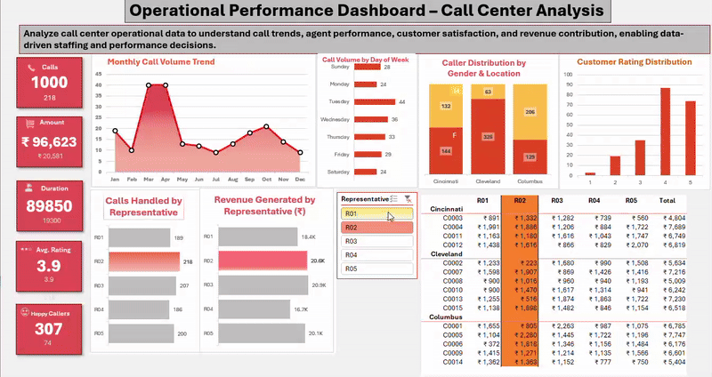

# operational-bi-call-center-analysis
An operational business intelligence dashboard built in Excel to analyze call center trends, agent efficiency, and customer satisfaction.

Operational Performance Dashboard – Call Center Analysis
🔍 Project Overview

This project analyzes call center operational data to understand call volume trends, agent performance, customer satisfaction, and revenue contribution. The goal is to support data-driven staffing, performance evaluation, and operational decision-making.

-----

##🎯 Business Objectives

Identify peak call periods by month and day

Evaluate agent-wise performance and revenue contribution

Analyze customer satisfaction through rating distribution

Highlight operational inefficiencies and improvement opportunities

-------

##🧾 Dataset Description (Explaination of  Raw Data)

The dataset represents call center interaction records, where each row corresponds to a single customer call.
-

**Key fields include:**

- **Call Date** – Date when the call occurred  
- **Representative** – Agent handling the call  
- **Call Duration** – Total time spent on the call  
- **Amount** – Revenue generated from the interaction (₹)  
- **Rating** – Customer satisfaction score (1–5)  
- **Gender & Location** – Customer demographics 

This data enables analysis across **time, agents, revenue, and customer experience**.

-------

##📈 Key KPIs Tracked

Total Calls Handled

Total Revenue Generated (₹)

Total Call Duration

Average Customer Rating

Happy Callers (High-rating interactions)

##📊 Dashboard Highlights

- **Monthly Call Trend:** Identifies seasonal peaks (March & October)  
- **Day-wise Call Volume:** Saturdays show the highest call load  
- **Agent Performance:** Comparison of calls handled vs. revenue generated  
- **Customer Ratings:** Majority of interactions rated 4–5, indicating positive experience  
- **Demographics:** Caller distribution by gender and location  
(Screenshots here 👇)

-------

##💡 Key Insights

Call volume spikes during specific months, indicating seasonal demand.

Weekends, especially Saturdays, require higher staffing.

Some agents generate higher revenue with fewer calls, indicating better efficiency.

Overall customer satisfaction is positive, but mid-level ratings present improvement scope.

------

##🧠 Business Recommendations

Increase staffing during peak months and weekends.

Use high-performing agents as benchmarks for training.

Focus on improving call resolution quality to increase 4+ ratings.

------

🛠 Tools Used

Microsoft Excel (PivotTables, Charts, Slicers)

Data Analysis & Business Intelligence techniques

## Dashboard Interactivity (Slicer Demo)

